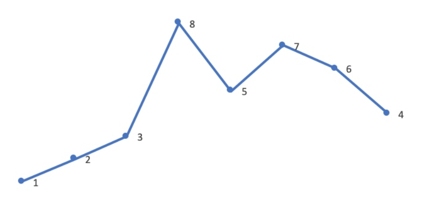

#### 整数数组的一个排列就是将其所有成员以序列或线性顺序排列。
- 例如，arr = [1,2,3] ，以下这些都可以视作 arr 的排列：[1,2,3]、[1,3,2]、[3,1,2]、[2,3,1]  
#### 整数数组的 下一个排列 是指其整数的下一个字典序更大的排列。更正式地，如果数组的所有排列根据其字典顺序从小到大排列在一个容器中，那么数组的 下一个排列 就是在这个有序容器中排在它后面的那个排列。如果不存在下一个更大的排列，那么这个数组必须重排为字典序最小的排列（即，其元素按升序排列）。 
- 例如，arr = [1,2,3] 的下一个排列是 [1,3,2] 。
- 类似地，arr = [2,3,1] 的下一个排列是 [3,1,2] 。 
- 而 arr = [3,2,1] 的下一个排列是 [1,2,3] ，因为 [3,2,1] 不存在一个字典序更大的排列。  

给你一个整数数组 nums ，找出 nums 的下一个排列。  
必须原地修改，只允许使用额外常数空间。
来源：力扣（LeetCode）
链接：https://leetcode.cn/problems/next-permutation

**思路：抓住一点，尽可能小地变大**  
**难点：理解为什么要找第一个逆序对**
0. 名词解释：
   - 值：将数组看作数值的代称
   - 数：数组中的某一个数
   

1. 题目分析：
   - 每次都尽可能小的变大
   - 值最大时，下一个排列是 最小值
  

2. 思路整理：
   - 首先要清楚，值不断变大的过程，是将尽可能大的数向前移动的过程
   - 要让值尽可能小的变大，我们可以采用逆向思维：
     - 值变大的过程，就是最大数（次大数，次次大数……）不断向前移动的过程
     - 我们从右向左移动指针，若为升序，说明升序范围内的值已是最大，此时范围内任何数变更，都不符合【值变大】
     - 总结：我们要找到第一个不符合【从右向左为升序】的数[i]，将它同右边任意数交换位置，都可满足【**值变大**】需求
   - 找到nums[i]后，从右向左继续寻找第一个比nums[i]大的数：
     - 如果说从右向左寻找比nums[i]大的数（一定可以找到），从而满足【变大】
     - 那么从右向左寻找第一个比nums[i]大的数nums[j]，可满足【**尽可能小的变大**】
   - 两数交换后，我们仍需继续处理值
     - 思考：数交换后，相当于使用新的数nums[j]作后半值的大领导（比原来的领导nums[i]数大）
     - 新的大领导，可以对后续值进行新的从小到大排序，**进一步确保值在【尽可能小的变大】**
     - 同时我们可以发现,交换不论前后，nums[i+1]一定为变更范围内的最大值，且从右向左为升序，那么重排序就简单起来了~
     

**3. 总结：**
   - 从右向左寻找第一个逆序数（第一次遍历O(n)）
   - 从右向左寻找第一个比逆序数大的数（第一次遍历O(n)）
   - 利用双指针进行重排序(O(n))  
   - 时间复杂度为：O(n)； 额外空间为：常量级

4. 思考：值最大时，下一个排列是 最小值 ，逻辑同上么？
    - 值最大时，第一个逆序对实际不存在，可使用 [i] 指向 索引-1 代替
    - 跳过寻找比逆序值大的数
    - 需要对数[i]后的范围 [0, length-1]进行重排序
    - 论证结果： 可以得到最小值，只需i < 0 时跳过第2步
   